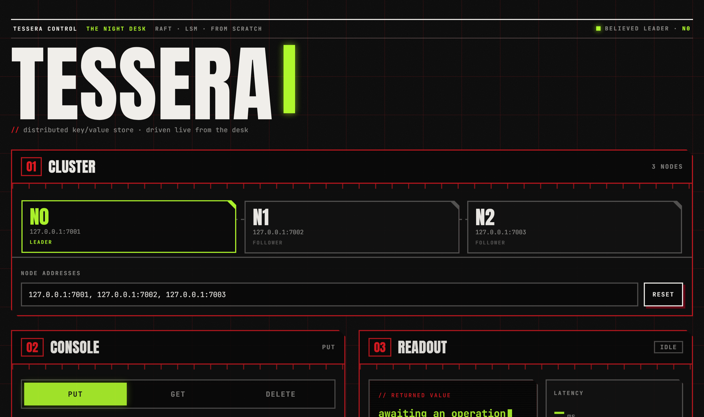

# tessera

[](https://github.com/santoshcheethiralame-dot/TESSERA/actions/workflows/ci.yml)

A distributed, sharded, replicated key-value store on a from-scratch storage engine. Pure Rust, standard library only — no external crates anywhere in the workspace.

Storage is an LSM-tree: memtable, SSTables, write-ahead log, size-tiered compaction, MVCC. Raft replicates each shard, with its term, vote, and log durable on disk. The keyspace is split across many Raft groups behind a coordinator, with a routing client on top. The CockroachDB/TiKV shape, scaled down.

## More than a coursework Raft KV

**Deterministic simulation testing.** Time, network, disk, scheduling, and randomness are all injectable. The whole cluster runs single-threaded inside a seeded world, so failure interleavings — partitions, message loss and duplication, reordering, node crashes — can be fuzzed by the thousand and any bug replays exactly from its seed. The way TigerBeetle and FoundationDB find the bugs that matter, built in from the start. It has already caught a real one: a split-brain that only surfaced on a specific seed, where a duplicated vote reply let a candidate win a sub-majority and two leaders emerged in one term. The full story: [Seed 99 — anatomy of a split brain](docs/seed-99.md).

**Linearizability checking.** A Wing–Gong checker validates client histories under all of the above — 1,000 randomized failure schedules, zero violations.

**The parts tutorials skip.** Snapshots and log compaction, linearizable reads via leader leases, membership changes via joint consensus, and crash-safe persistence with recovery on restart.

**Measured, not claimed.** p50/p99 latency and throughput on real disk, and the same Raft/LSM run over a real TCP cluster ([BENCHMARKS.md](BENCHMARKS.md)).

## Design

Consensus and storage are pure state machines. They consume events (a delivered message, a fired timer, a finished disk write) and return intents (send a message, set a timer, persist state). They never read the clock or touch the network themselves. In production a real driver runs them; in tests the simulator does — the same code either way, which is exactly what makes the fuzzing possible.

The rules that keep it deterministic: a single seeded RNG, an event queue ordered by `(time, sequence)`, and no `HashMap` on any path that affects behavior.

## Durability

Raft's term, vote, and log are `fsync`'d before a reply leaves the node, written to a temp file and atomically renamed so a crash never leaves a torn state. A node survives crash-restart without double-voting or dropping a committed write. The simulator kills and restarts nodes mid-flight and the linearizability checker still passes — the crash chaos the whole DST design was built to make possible.

## Status

- [x] Simulation kernel — seeded RNG, virtual clock, event scheduler, network faults, partitions, crashes
- [x] LSM storage engine — WAL, MVCC memtable, SSTables, bloom filters, size-tiered compaction, crash recovery
- [x] Raft group + KV state machine — election, log replication, LSM-backed apply
- [x] Linearizability checker + chaos fuzzing — Wing–Gong, seed-reproducible, caught a real split-brain
- [x] Snapshots, leader leases, joint-consensus membership
- [x] Durable Raft state + crash-restart recovery + crash chaos
- [x] Pipelined replication — bursts coalesce and batch (~83k writes/s in the simulator)
- [x] Sharding, coordinator, routing client
- [x] Real TCP transport — the same Raft/LSM over sockets, threads, and OS timers; a runnable cluster, a TCP client, and a browser console
- [x] Benchmarks ([BENCHMARKS.md](BENCHMARKS.md))

## Same code, real network

The simulator proves correctness; the `server` crate proves it runs. It drives the *unchanged* `Raft<LsmKv<RealDisk>>` under a production runtime — an acceptor and per-connection reader threads, per-peer writers, an event loop on real OS timers — over a hand-rolled length-prefixed wire codec, persisting to disk. Start a three-node cluster and drive it from a browser:

```
cargo run -p server --bin tessera-server -- 0 127.0.0.1:7001 ./data/n0 1=127.0.0.1:7002 2=127.0.0.1:7003
cargo run -p server --bin tessera-server -- 1 127.0.0.1:7002 ./data/n1 0=127.0.0.1:7001 2=127.0.0.1:7003
cargo run -p server --bin tessera-server -- 2 127.0.0.1:7003 ./data/n2 0=127.0.0.1:7001 1=127.0.0.1:7002
cargo run -p server --bin tessera-ui -- 127.0.0.1:8080    # console at http://127.0.0.1:8080
```



The console shows the live topology — the leader lights up, and it follows a failover on its own: kill the leader's process and the highlight moves to the newly elected node a few seconds later, while the killed node recovers its Raft state from disk and rejoins.

## Build & run

```
cargo test                                           # full deterministic test suite
cargo test -p consensus --test chaos -- --ignored    # 1000-seed linearizability fuzz
cargo test -p consensus --test crash                 # crash-restart safety under a reboot nemesis
cargo test -p server --test networked                # 3-node cluster over real TCP: elect, replicate, kill, recover
cargo run --release -p bench                          # benchmarks (see BENCHMARKS.md)
```

## Documentation

- [Architecture](docs/architecture.md) — the crate map, the state-machine/driver split, and the life of a write
- [Deterministic simulation](docs/simulation.md) — how the seeded world works and what the harnesses check
- [Seed 99](docs/seed-99.md) — the split-brain bug the fuzz caught, from alarm to fix
- [Benchmarks](BENCHMARKS.md) — real numbers on real disk, in the simulator, and over TCP

## License

MIT — see [LICENSE](LICENSE).
